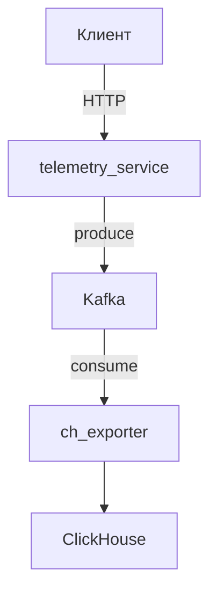
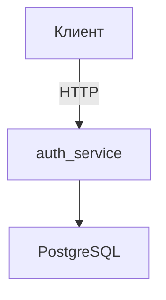

# Yet Another Homework

### 1. Архитектура потока телеметрии

```mermaid
flowchart TD
    A[Клиент] -->|HTTP| B[telemetry_service]
    B -->|produce| C[Kafka]
    C -->|consume| D[ch_exporter]
    D --> E[ClickHouse]
```

### 2. Архитектура сервиса авторизации

```mermaid
flowchart TD
    A[Клиент] -->|HTTP| B[auth_service]
    B --> C[PostgreSQL]
```